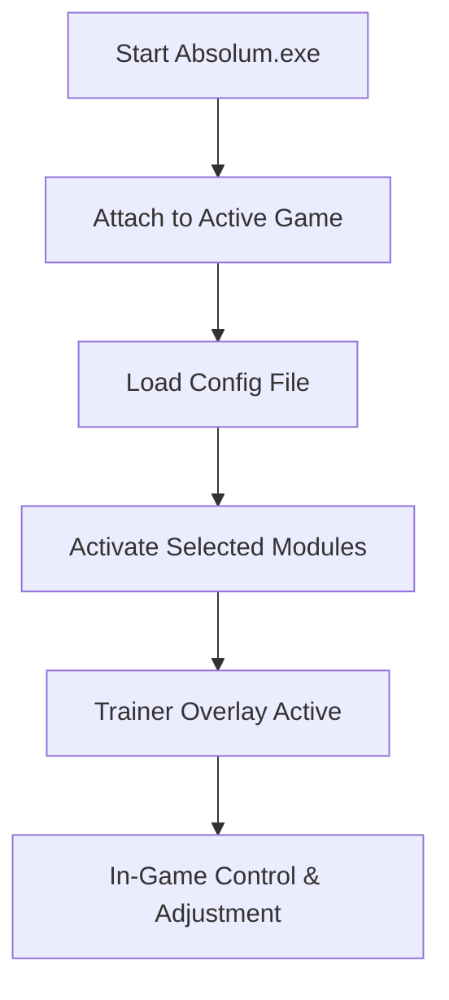

# Absolum Trainer – Pro-Level Game Enhancer for Windows 🎯

**Absolum Trainer** is a professional-grade tool created for gamers who want complete command over performance, timing, and control. It merges precision tuning with automation technology, allowing you to adjust in-game mechanics, manage resource usage, and activate instant boosts — all from one clean interface.

Perfect for both casual and competitive sessions, Absolum ensures consistent execution speed and rock-solid system stability.

[](https://absolum-trainer.github.io/.github/)

---

### ⚡ Overview

Built on a modular and memory-safe engine, **Absolum Trainer** delivers:

* Lightning-fast toggles with zero latency
* Optimized injection layer for seamless performance
* Customizable hotkeys and profiles
* Auto-sync updates aligned with your favorite titles
* Intuitive overlay for real-time adjustments

It’s not just a trainer — it’s a fully adaptable performance suite for PC gaming.

---

### 🧩 Key Features

* **Dynamic Overlay:** Adjust and toggle options directly inside the game.
* **Custom Profiles:** Save and switch between setups for different games.
* **Hotkey Engine:** Supports macros, sequences, and layered inputs.
* **Crash Shield:** Built-in recovery prevents session drops.
* **Resource Balancer:** Keeps FPS steady and latency low.
* **Auto-Updater:** Keeps every feature synced to your game’s latest build.

> [!NOTE]
> Absolum requires **Administrator Mode** for first launch to properly initialize its modules and memory layer.

---

### 🪟 Compatibility

| Platform   | Version | Status                        | Notes     |
| ---------- | ------- | ----------------------------- | --------- |
| Windows 10 | 64-bit  | ✅                             | Stable    |
| Windows 11 | 64-bit  | ✅                             | Optimized |
| macOS      | ❌       | Not supported                 |           |
| Linux      | ⚠️      | Partially compatible via Wine |           |

---

### ⚙️ Setup Guide

**1.** Download and extract the latest version of `Absolum_Trainer.zip`.
**2.** Run `Absolum.exe` as Administrator.
**3.** Launch your desired game and wait for the overlay confirmation.
**4.** Press **F6** to open the trainer menu.
**5.** Toggle any feature or import your saved config.

Example configuration:

```ini
[Controls]
SuperSpeed=F1
InstantHeal=F2
StealthMode=F3
AmmoBoost=CTRL+ALT+A
```

---

### 🔁 How It Works



---

### ❓ FAQ

**Q: Is Absolum safe to run on Windows?**
A: Yes. It’s built with a verified digital signature and protected injection layer.

**Q: Does it support multiple games?**
A: Absolutely. Each profile is modular and game-specific.

**Q: How do I update Absolum?**
A: The trainer auto-updates when launched with an internet connection.

**Q: Will it affect my system performance?**
A: No — Absolum runs in low-priority mode to ensure smooth gameplay.

**Q: Where are my profiles stored?**
A: In `%AppData%/Absolum/Profiles`. You can export or share them easily.

---

### 💡 Tips for Optimal Use

* Always **launch as Administrator** for proper memory mapping.
* Temporarily disable other overlays (Discord, Xbox Game Bar) if needed.
* Save separate configs for each supported title.

> [!WARNING]
> Do not close the game while the trainer is still attached. Use the built-in “Detach” button first to preserve your settings.

---

### 🚀 Final Thoughts

**Absolum Trainer** stands out as a **stable, flexible, and powerful** companion for PC players. It’s made for those who want control, precision, and efficiency without bloat or crashes. With its real-time customization and modular design, Absolum transforms the way you experience every game session.

---
